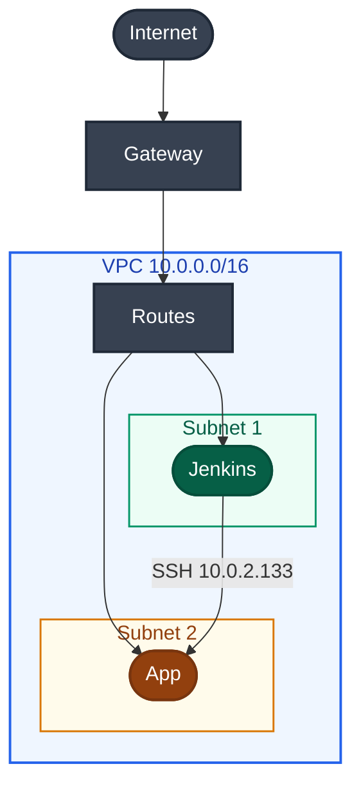
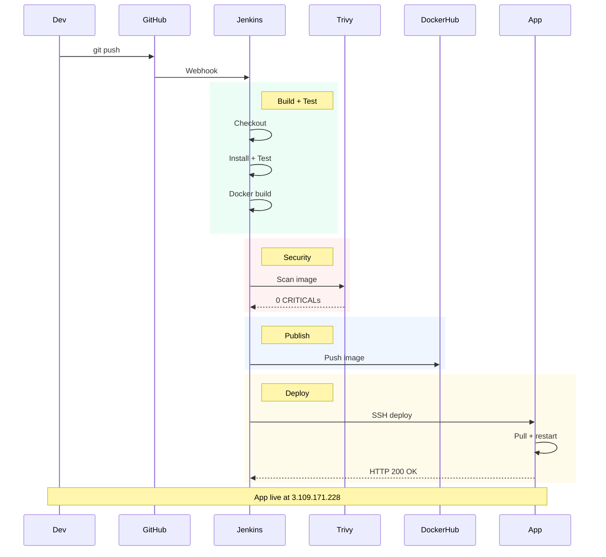
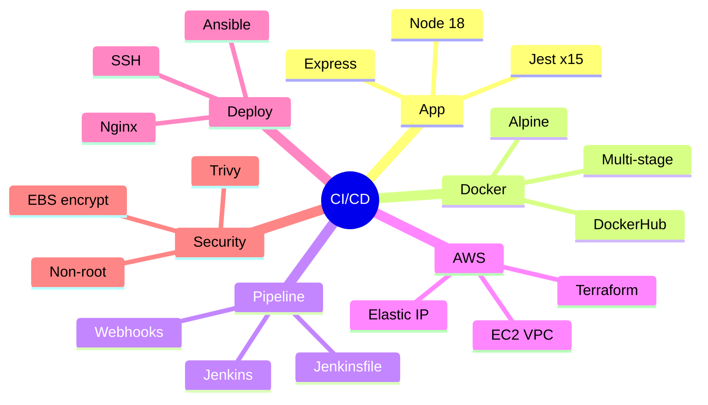

# Architecture Diagrams

---

## CI/CD Pipeline Flow

```mermaid
flowchart LR
    A([Developer]):::dev -->|git push| B([GitHub]):::gh
    B -->|webhook| C([Jenkins]):::jk

    C --> D[Checkout]:::s1
    D --> E[Install]:::s1
    E --> F[Test]:::s1
    F --> G[Build]:::s2
    G --> H{Scan}:::s3
    H -->|safe| I[Push]:::s2
    H -->|unsafe| X((Block)):::s3
    I --> J[Deploy]:::s4
    J --> K[Verify]:::s1

    I -.->|image| L[(DockerHub)]:::dk
    J -.->|SSH| M([App Server]):::s4

    M --> N[Nginx]:::s4
    N --> O[Container]:::s2
    O --> P[API]:::s1

    Q([Users]):::usr -.->|HTTP| N

    classDef dev fill:#7c3aed,color:#fff,stroke:#6d28d9,stroke-width:2px
    classDef gh fill:#1f2937,color:#fff,stroke:#111827,stroke-width:2px
    classDef jk fill:#065f46,color:#fff,stroke:#064e3b,stroke-width:2px
    classDef s1 fill:#059669,color:#fff,stroke:#047857,stroke-width:1.5px
    classDef s2 fill:#2563eb,color:#fff,stroke:#1d4ed8,stroke-width:1.5px
    classDef s3 fill:#dc2626,color:#fff,stroke:#b91c1c,stroke-width:1.5px
    classDef s4 fill:#d97706,color:#fff,stroke:#b45309,stroke-width:1.5px
    classDef dk fill:#0891b2,color:#fff,stroke:#0e7490,stroke-width:2px
    classDef usr fill:#7c3aed,color:#fff,stroke:#6d28d9,stroke-width:1.5px
```

**Color Legend:** `Green` = pass/verify · `Blue` = build/push · `Red` = security gate · `Orange` = deploy

| # | Stage | Tool | Action | On Fail |
|---|-------|------|--------|---------|
| 1 | Checkout | Git | Clone repo | Stops |
| 2 | Install | npm | `npm ci --maxsockets=2` | Stops |
| 3 | Test | Jest | 15 tests via Supertest | Code blocked |
| 4 | Build | Docker | Multi-stage ~120MB | Stops |
| 5 | Scan | Trivy | Strict: 0 CRITICALs | Image blocked |
| 6 | Push | Docker | Tag: BUILD-SHA + latest | Stops |
| 7 | Deploy | SSH | deploy.sh via VPC | Stops |
| 8 | Verify | curl | Nginx health HTTP 200 | Stops |

---

## AWS Infrastructure

| | Jenkins Server | App Server |
|--|---------------|------------|
| **Type** | t3.small | t3.micro Free Tier |
| **RAM** | 2GB + 2GB swap | 1GB |
| **Disk** | 20GB gp3 encrypted | 15GB gp3 encrypted |
| **EIP** | 13.126.223.204 | 3.109.171.228 |
| **Private** | 10.0.1.x | 10.0.2.133 |
| **Ports** | 22, 8080 | 22, 80, 443 |
| **Stack** | Jenkins, Docker, Trivy, Ansible | Docker, Nginx, Node.js |
| **Subnet** | 10.0.1.0/24 | 10.0.2.0/24 |
| **AZ** | ap-south-1a | ap-south-1b |

**Security Groups:**

| Rule | Jenkins SG | App SG |
|------|-----------|--------|
| SSH :22 | My IP only | My IP + Jenkins SG |
| Service | :8080 my IP | :80 + :443 public |
| Outbound | All | All |

---

## Deployment Sequence

---

## Tech Stack

---

## Key Metrics

| Metric | Value |
|--------|-------|
| Pipeline stages | 8 |
| Duration | ~5 min |
| Tests | 15 Jest + Supertest |
| Image size | ~120MB Alpine |
| Security | Trivy strict: 0 CRITICALs |
| Restart | unless-stopped |
| Logs | 10MB x 3 = 30MB max |
| Tags | BUILD_NUM-GIT_SHA |

---

> Static SVG version: [pipeline-diagram.svg](pipeline-diagram.svg)
